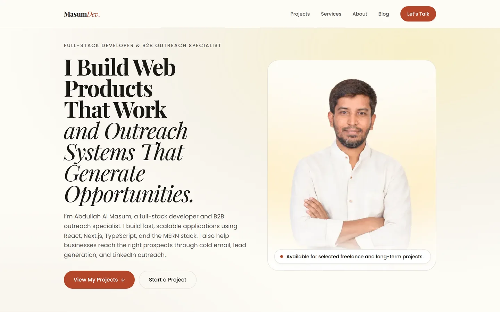

# MasumDev Portfolio

The personal portfolio of **Abdullah Al Masum** — a full-stack web developer and B2B cold email outreach specialist. Built with Next.js 16 (App Router), React 19, TypeScript, and Tailwind CSS v4.

**Live site:** https://masumdev.com



## Overview

The site presents two related offerings under one identity. Development work — SaaS products, dashboards, marketplaces, and APIs built on React, Next.js, and the MERN stack — leads the page and carries the primary positioning. B2B outreach work — cold email infrastructure, deliverability, lead generation, and LinkedIn prospecting — follows as supporting expertise.

The design is editorial rather than decorative: the interest comes from typographic scale, whitespace, and warm color blocking. Sections alternate between two background tones for rhythm, entry motion is limited to short fades that honor `prefers-reduced-motion`, and cards use hairline borders instead of drop shadows.

## Features

- **Server-first App Router architecture** — every route is prerendered at build time, with focused Client Components only where browser interaction is required.
- **File-based MDX blog** with frontmatter validated by zod at build time, draft support, and per-post cover images.
- **Validated contact form** — zod checks the input in the browser before it posts to Web3Forms.
- **Design tokens in CSS** — colors, font stacks, and a fluid type scale declared once in `src/app/globals.css`; components never hardcode a hex value.
- **Content separated from markup** — every section maps over a typed array in `src/data/`, so copy changes never touch JSX.
- **Generated `sitemap.xml`, `robots.txt`, and OpenGraph image** from the App Router's metadata files.
- **Accessible by construction** — semantic landmarks, one `<h1>`, no heading-level skips, visible focus rings, and contrast-checked color pairings.

## Technology stack

| Layer | Choice | Version |
|---|---|---|
| Framework | Next.js (App Router, Turbopack) | 16 |
| UI runtime | React / React DOM | 19 |
| Language | TypeScript (strict, no `any`) | 5 |
| Styling | Tailwind CSS (CSS-first, no config file) | 4 |
| Components | HeroUI (`@heroui/react`) | 3 |
| Variants | tailwind-variants | 3 |
| Icons | react-icons | 5 |
| Validation | zod | 4 |
| MDX | next-mdx-remote + gray-matter | 6 / 4 |
| Compiler | babel-plugin-react-compiler | 1 |

Typography is Playfair Display (headings) and Poppins (body), loaded through `next/font/google`.

## Site structure

The homepage composes nine sections in this order:

| # | Section | Anchor |
|---|---|---|
| 1 | Hero | `#home` |
| 2 | About | `#about` |
| 3 | Technical Skills | `#skills` |
| 4 | Services | `#services` |
| 5 | Projects | `#projects` |
| 6 | Testimonials | `#testimonials` |
| 7 | Outreach Stack | `#stack` |
| 8 | Pricing | `#pricing` |
| 9 | Contact | `#contact` |

Additional routes: `/resources` (recommended outreach tools, with affiliate disclosure), `/blog` (article index), and `/blog/[slug]` (article pages).

## Featured projects

| Project | Type | Live | Source |
|---|---|---|---|
| **DentFlow** | Dental practice management SaaS | [dentflow-eight.vercel.app](https://dentflow-eight.vercel.app/) | [dentflow](https://github.com/masumgaibandha/dentflow) |
| **SkillPath AI** | AI-powered learning platform | [skillpath-ai-frontend-umber.vercel.app](https://skillpath-ai-frontend-umber.vercel.app) | [skillpath-ai](https://github.com/masumgaibandha/skillpath-ai) |
| **TaskForge** | Freelance micro-task marketplace with Stripe payments | [taskforge-client.vercel.app](https://taskforge-client.vercel.app/) | [client](https://github.com/masumgaibandha/taskforge-client) · [server](https://github.com/masumgaibandha/taskforge-server) |
| **B2B Outreach System** | Cold email and lead generation workflow | — | — |

The B2B Outreach System is client work, so it has no public URL.

## Technical Skills section

Fifteen development technologies in three content-sized cards, each skill shown as its real brand mark beside a visible name. The rows are plain list items — not links or buttons — and carry no proficiency scores or progress bars.

| Category | Technologies |
|---|---|
| Frontend Development | HTML5, CSS3, JavaScript, TypeScript, React.js, Next.js, Tailwind CSS |
| Backend & Database | Node.js, Express.js, MongoDB, REST APIs |
| Tools & Deployment | Git, GitHub, Vercel, Netlify |

Marks come from `react-icons/si`, except REST APIs, which has no official brand logo and uses a generic glyph in the site's accent color. Every icon color is at least 3:1 against the white card, and icons are `aria-hidden` because each name is always rendered as text.

Content lives in `src/data/skills.ts`; the section renders from it.

## Blog

Articles are MDX files in `content/blog/`, where the filename becomes the URL slug:

```
content/blog/cold-email-infrastructure.mdx  ->  /blog/cold-email-infrastructure
```

Frontmatter is validated by zod in `src/lib/blog.ts`. A malformed date or a missing description fails the build and names the offending file rather than shipping broken metadata. Publishing requires both `coverImage` and `coverAlt` — there is no fallback artwork. Posts marked `draft: true` are visible in `npm run dev`, excluded from `npm run build`, left out of the sitemap, and marked `noindex`.

**Full authoring guide, including every frontmatter field:** [`content/blog/README.md`](content/blog/README.md)

Copy `content/blog/example-article.mdx` to start a new post.

## Contact form

The form is client-side validated with zod, then posts a `FormData` body directly to `https://api.web3forms.com/submit`. There is no `/api/contact` route.

The `NEXT_PUBLIC_` prefix on the access key is deliberate: the Web3Forms free plan expects a browser-side submission, and proxying it server-side requires a paid plan with a safelisted IP. The key only permits sending a message to the owner's verified inbox. Without the key configured, the form shows an error pointing at the direct email address.

## Environment variables

| Variable | Required | Purpose |
|---|---|---|
| `NEXT_PUBLIC_WEB3FORMS_ACCESS_KEY` | Yes, for contact delivery | Web3Forms access key, bound to the verified inbox |

Copy the template and fill in your own value:

```bash
cp .env.example .env
```

Obtain a key from [web3forms.com](https://web3forms.com). **Never commit `.env`** — it is listed in `.gitignore`, and only `.env.example` (which holds no value) is tracked.

## Getting started

Requires **Node.js 20.9 or newer** (Next.js 16 engine requirement) and npm.

```bash
git clone https://github.com/masumgaibandha/final-portfolio.git
cd final-portfolio
npm install
cp .env.example .env   # then add your Web3Forms key
npm run dev
```

The dev server runs at http://localhost:3000.

## Scripts

| Command | Description |
|---|---|
| `npm run dev` | Start the development server |
| `npm run build` | Production build |
| `npm run start` | Serve the production build |
| `npm run lint` | Run ESLint |

Type checking is not wired to a script; run it directly:

```bash
npx tsc --noEmit
```

`npm run build` must pass before a change is considered done — it catches Server/Client Component boundary errors that `dev` tolerates.

## Project structure

```
content/blog/          MDX articles + authoring guide
docs/                  README assets
public/                Static assets (portrait, project and blog images)
src/app/               Routes, layout, metadata, globals.css
  ├─ page.tsx          Homepage — composes the nine sections
  ├─ blog/             Blog index and article pages
  ├─ resources/        Recommended outreach tools
  ├─ sitemap.ts        Generated sitemap
  ├─ robots.ts         Generated robots.txt
  └─ opengraph-image.tsx
src/components/
  ├─ sections/         One file per homepage section
  ├─ ui/               Container, Section, SectionHeading, Button, Logo
  └─ blog/             MDX component mapping
src/data/              Typed content arrays
src/lib/               Blog loading, contact schema
src/types/             Shared interfaces
```

## Deployment

The site deploys to Vercel from the `main` branch. Pushing triggers a build:

```bash
git add <files>
git commit -m "Describe the change"
git push origin main
```

`NEXT_PUBLIC_WEB3FORMS_ACCESS_KEY` must be set in the Vercel project's environment variables — the local `.env` is not deployed. Pull requests receive preview deployments; `main` publishes to production.

## Author

**Abdullah Al Masum** — Full-Stack Developer & B2B Outreach Specialist

- Website: https://masumdev.com
- GitHub: [@masumgaibandha](https://github.com/masumgaibandha)
- LinkedIn: [almasumbd](https://www.linkedin.com/in/almasumbd)
- X: [@almasumbd](https://x.com/almasumbd)
- Upwork: [Profile](https://www.upwork.com/freelancers/~01a5eccfaf40a8a065?viewMode=1)
